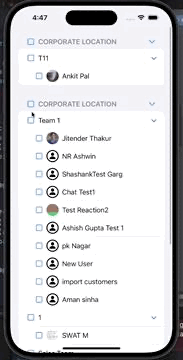

To add the new project "Hierarchy Assessment" to your `RepCard-Assessment` repository, including the setup and demo, follow this structure:

---

# RepCard-Assessment

This repository contains the assessment project for RepCard, showcasing three implementations of the same layout using different frameworks.

## Demo

 <!-- Replace with the actual path to your GIF -->

## Projects Included

- **RepCard-Assessment-SwiftUI**
- **RepCard-Assessment-UIKit**
- **Hierarchy-Assessment**

## Overview

The `RepCard-Assessment` repository demonstrates the conversion of a layout similar to a spreadsheet (like MS Excel) into different implementations:

1. **SwiftUI**: The `RepCard-Assessment-SwiftUI` project uses SwiftUI to create the UI.
2. **UIKit**: The `RepCard-Assessment-UIKit` project uses UIKit and compositional layout for the same UI.
3. **Hierarchy-Assessment**: The `Hierarchy-Assessment` project demonstrates hierarchical data structure representation using a custom layout (Add specific framework or tools if used).

## Setup and Usage

### SwiftUI Project

1. Open `RepCard-Assessment-SwiftUI` in Xcode.
2. Build and run the project.

### UIKit Project

1. Open `RepCard-Assessment-UIKit` in Xcode.
2. Build and run the project.

### Hierarchy Assessment Project

1. Open `Hierarchy-Assessment` in Xcode.
2. Build and run the project.

## Demo

 <!-- Replace with the actual path to your GIF -->

## Contributions

For any contributions or issues, please reach out to the repository author: [ayushmetaverse](https://github.com/ayushmetaverse).

## License

This project is licensed under the MIT License. See the [LICENSE](LICENSE) file for details.
